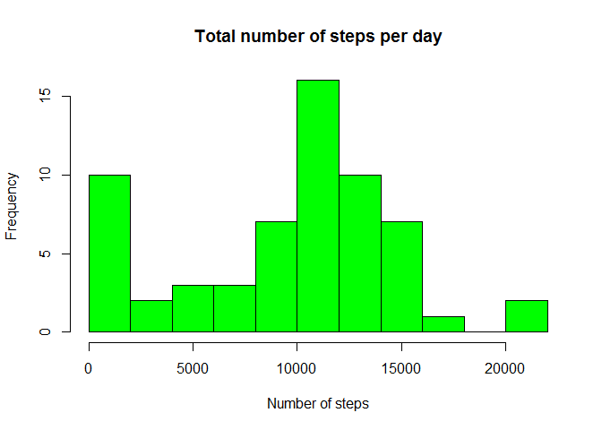
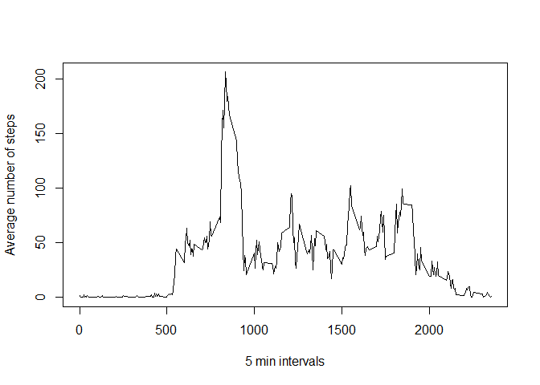

# Reproducible Research: Peer Assessment 1
Dmitry Baranov  
November 2017  


## Personal movement activity

It is now possible to collect a large amount of data about personal movement using activity monitoring devices such as a Fitbit, Nike Fuelband, or Jawbone Up. These type of devices are part of the "quantified self" movement - a group of enthusiasts who take measurements about themselves regularly to improve their health, to find patterns in their behavior, or because they are tech geeks. But these data remain under-utilized both because the raw data are hard to obtain and there is a lack of statistical methods and software for processing and interpreting the data.

## Loading and preprocessing the data

Download data from the course web [site](https://d396qusza40orc.cloudfront.net/repdata%2Fdata%2Factivity.zip).


```r
if (!dir.exists("./data"))
    dir.create("./data")

download.file("https://d396qusza40orc.cloudfront.net/repdata%2Fdata%2Factivity.zip", "./data/activity.zip")
unzip("./data/activity.zip", exdir = "./data")
activity <- read.table("./data/activity.csv", header= TRUE, sep = ',', stringsAsFactors = FALSE, na.strings = "NA")

head(activity)
```

```
##   steps       date interval
## 1    NA 2012-10-01        0
## 2    NA 2012-10-01        5
## 3    NA 2012-10-01       10
## 4    NA 2012-10-01       15
## 5    NA 2012-10-01       20
## 6    NA 2012-10-01       25
```

Transform char dates into Date class

```r
activity$date <- as.Date(activity$date, format = "%Y-%m-%d")
```

## What is mean total number of steps taken per day?

Histogram of the total number of steps taken each day


```r
day.activity <- activity %>% group_by(date) %>% summarize(total.steps = sum(steps, na.rm = TRUE))
hist(day.activity$total.steps, breaks = 8, col = "green", xlab = "Number of steps", main = "Total number of steps per day")
```

<!-- -->

Mean

```r
mean(day.activity$total.steps, na.rm = TRUE)
```

```
## [1] 9354.23
```

Median

```r
median(day.activity$total.steps, na.rm = TRUE)
```

```
## [1] 10395
```

## What is the average daily activity pattern?

Time series plot of the 5-minute interval and the average number of steps taken, averaged across all days

```r
interval.activity <- activity %>% group_by(interval) %>% summarize(mean.steps = mean(steps, na.rm = TRUE))
with(interval.activity, plot(x = interval, y = mean.steps, type = "l", xlab = "5 min intervals", ylab = "Average number of steps"))
```

<!-- -->

Interval with maximum number of steps on average

```r
interval.activity$interval[which.max(interval.activity$mean.steps)]
```

```
## [1] 835
```

## Imputing missing values

Number of rows with missing values

```r
nrow(activity[!complete.cases(activity), ])
```

```
## [1] 2304
```

Let's fill in the missing steps values with median values of steps for interval. I suggest that every day in the same interval has similar number of steps in average.

```r
interval.median.steps <- activity %>% group_by(interval) %>% summarize(median.steps = median(steps, na.rm = TRUE))
activity.full <- activity %>% inner_join(interval.median.steps, by = "interval") %>% mutate(steps = ifelse(is.na(steps), median.steps, steps)) %>% select(steps, date, interval)
```

Histogram of the total number of steps taken each day with filled missing values


```r
day.activity.full <- activity.full %>% group_by(date) %>% summarize(total.steps = sum(steps))
hist(day.activity.full$total.steps, breaks = 8, col = "green", xlab = "Number of steps", main = "Total number of steps per day")
```

<!-- -->

Mean with filled missing vales

```r
mean(day.activity.full$total.steps)
```

```
## [1] 9503.869
```

Median with filled missing vales

```r
median(day.activity.full$total.steps)
```

```
## [1] 10395
```

In results, there is no difference between data sets with and without missing values. Therefore, there is no impact of missing values on the estimates of the total daily number of steps.


## Are there differences in activity patterns between weekdays and weekends?

Indicate date as _weekday_ or _weekend_

```r
activity.full <- activity.full %>% mutate(weekpart = as.factor(ifelse(weekdays(date, abbreviate = TRUE) %in% c("Sat","Sun"), "weekend", "weekday")))
```
Time series plot of the 5-minute interval and the average number of steps taken, averaged across all weekday days or weekend days


```r
weekpart.interval.mean.steps <- activity.full %>% group_by(weekpart, interval) %>% summarize(mean.steps = mean(steps))
xyplot(mean.steps ~ interval | weekpart, data = weekpart.interval.mean.steps, layout = c(1,2), type = "l", ylab = "Number of steps", xlab = "Interval")
```

<!-- -->

## My software environment


```r
sessionInfo()
```

```
## R version 3.4.1 (2017-06-30)
## Platform: x86_64-w64-mingw32/x64 (64-bit)
## Running under: Windows 7 x64 (build 7601) Service Pack 1
## 
## Matrix products: default
## 
## locale:
## [1] LC_COLLATE=English_United States.1252 
## [2] LC_CTYPE=English_United States.1252   
## [3] LC_MONETARY=English_United States.1252
## [4] LC_NUMERIC=C                          
## [5] LC_TIME=English_United States.1252    
## 
## attached base packages:
## [1] stats     graphics  grDevices utils     datasets  methods   base     
## 
## other attached packages:
## [1] bindrcpp_0.2    lattice_0.20-35 dplyr_0.7.3    
## 
## loaded via a namespace (and not attached):
##  [1] Rcpp_0.12.12     digest_0.6.12    rprojroot_1.2    assertthat_0.2.0
##  [5] grid_3.4.1       R6_2.2.2         backports_1.1.1  magrittr_1.5    
##  [9] evaluate_0.10.1  rlang_0.1.2      stringi_1.1.5    rmarkdown_1.6   
## [13] tools_3.4.1      stringr_1.2.0    glue_1.1.1       yaml_2.1.14     
## [17] compiler_3.4.1   pkgconfig_2.0.1  htmltools_0.3.6  bindr_0.1       
## [21] knitr_1.17       tibble_1.3.4
```
